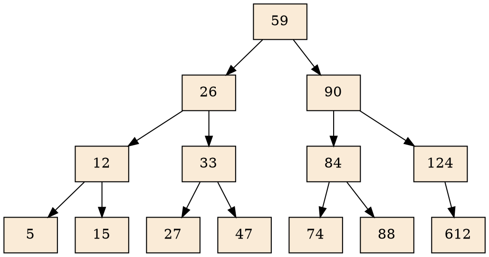

# 📚 Biblioteca Mágica

## 🎯 Objetivo General

Desarrollar una aplicación de consola en **C++** que gestione un catálogo de libros utilizando múltiples estructuras de datos avanzadas, permitiendo operaciones rápidas y especializadas de búsqueda, inserción y eliminación, mientras se evalúa el rendimiento comparativo entre diferentes algoritmos.

## 🎯 Objetivos Específicos

- Implementar estructuras de datos desde cero.

- Asegurar que todas las estructuras se actualicen correctamente al agregar o eliminar un libro.

- Comparar tiempos de ejecución entre métodos secuenciales y binarios.

- Ofrecer una interfaz intuitiva para el usuario.

- Probar el sistema con un catálogo de más de 1000 libros y medir tiempos de respuesta.

## 📝 Descripción

Imagina una biblioteca antigua donde los libros no solo se ordenan por título, sino que flotan en esferas de cristal organizadas por fechas, se agrupan en estantes que crecen como árboles según su género, y cada ISBN es un hechizo que te transporta al libro al instante.

- Cada estructura de datos es un **artefacto mágico** con un propósito único.

- Los libros son **grimorios** que deben encontrarse en milisegundos, sin importar cómo los busques.

- Incluso el **fantasma del bibliotecario** te dirá cuál es el método de búsqueda más rápido.

## 🛠 Estructuras y Funcionalidades

| Operación              | Estructura Utilizada         | Detalle                                                                                                                                                                                 |
| ---------------------- | ---------------------------- | --------------------------------------------------------------------------------------------------------------------------------------------------------------------------------------- |
| **Agregar libro**      | Todas las estructuras.       | Se inserta en AVL o Árbol B, Árbol B+.                                                                                                                                                  |
| **Buscar por título**  | Árbol AVL + Búsqueda binaria | El AVL ordena por título. Búsqueda binaria en nodos hoja.                                                                                                                               |
| **Buscar por ISBN**    | Búsqueda Binaria             | ISBN como clave única. Manejar colisiones con sondeo o encadenamiento.                                                                                                                  |
| **Buscar por género**  | Árbol B+                     | Clave secundaria: género. Permite recorrer libros de un género eficientemente.                                                                                                          |
| **Buscar por fecha**   | Árbol B                      | Clave: Año de publicación. Soporta rangos (ej: libros entre 2000-2010).                                                                                                                 |
| **Eliminar libro**     | Todas las estructuras        | Eliminar coherentemente el libro de todas las estructuras.                                                                                                                              |
| **Listar por título**  | Recorrido in-order (AVL)     | Muestra libros ordenados alfabéticamente.                                                                                                                                               |
| **Comparar búsquedas** | -                            | Mide tiempos: Búsqueda Secuencial (lista enlazada) vs Binaria (AVL ordenado por título), y Búsqueda Secuencial (lista enlazada) vs Búsqueda Binaria (arreglo/vector ordenado por ISBN). |


---

## 📚 Gestión de Libros

**Operaciones:**

- Agregar libro

- Eliminar libro

**Estructura del libro:**

```cpp
{
    string titulo; 
    string isbn;
    string genero; 
    string fecha; 
    string autor;
}
```

---

## 🔍 Búsquedas

- **Por Título (AVL + Búsqueda Binaria):**
  
  ```cpp
  Libro* buscarPorTitulo(string titulo);
  ```

- **Por ISBN:**
  
  ```cpp
  Libro* buscarPorISBN(string isbn);
  ```

- **Por Género (Árbol B+):**
  
  ```cpp
  ListaLibros buscarPorGenero(string genero);
  ```

- **Por Rango de Fechas (Árbol B):**
  
  ```cpp
  ListaLibros buscarPorRangoFechas(int inicio, int fin);
  ```

---

## ⚡ Rendimiento

En este proyecto, la comparación de métodos de búsqueda es una funcionalidad clave para demostrar la eficiencia de cada estructura de datos.

### 1️⃣ Búsqueda Secuencial

- **Estructura:** Lista no ordenada

- **Algoritmo:** Iterar elemento por elemento hasta encontrar coincidencia

- **Métodos:**
  
  ```cpp
  BuscarPorTitulo()
  BuscarPorISBN()
  ```

### 2️⃣ Búsqueda Binaria

- **Estructura:** Árbol AVL ordenado por título

- **Algoritmo:** Búsqueda binaria clásica en BST

### 3️⃣ Búsqueda Binaria por ISBN

- **Estructura:** Árbol o vector ordenado por ISBN

- **Algoritmo:** Aplicar búsqueda binaria y resolver colisiones

---

## 📂 Carga de Archivo CSV

Formato esperado:

```
"Título","ISBN","Género","Año","Autor"
```

- Campos entre comillas y separados por comas

- ISBN único (clave principal)

- Año numérico entero válido

```
"Titulo","ISBN","Género","Año","Autor"
"EL Señor de los Anillos","978-84-450-7274-4","Fantasia","1954","J.R.R. Tolkien"
"Cien Años de Soledad","978-84-376-0494-7","Realismo Magico","1967","Gabriel Garcia Marquez"
"1984","978-0-452-28423-4","Distopia","1949","George Orwell"
"Harry Potter y la piedra filosofal","978-84-9838-236-7","Fantasia","1997","J.K. Rowling"
"Don Quijote de la Mancha","978-84-376-0493-6","Clasico","1605","Miguel de Cervantes"
```

**Validaciones:**

- Verificar existencia y legibilidad del archivo

- Ignorar líneas mal formateadas

- Validar campos críticos: ISBN único, año numérico

**Pruebas a realizar:**

- Archivo válido: todos los libros se cargan correctamente

- Archivo corrupto: ignorar líneas inválidas

- Archivo vacío: no debe generar errores

- Ruta inexistente: mostrar mensaje de error

---

## 🌳 Gráficas de Árboles

- Permitir visualización gráfica de los árboles AVL, B y B+

- Representaciones claras para demostración

Como el siguiente grafico en grphiz dot:



---

## ⚖ Consideraciones

### Documentación Técnica

* Se debe incluir la complejidad de cada algoritmo utilizado en el proyecto.
* La notación BigO debe justificarse adecuadamente para cada implementación.

### Estructuras de Datos Implementadas desde Cero

* Los árboles, listas enlazadas, pilas y colas deben ser implementados desde cero.

### Prohibición de Librerías de Estructuras de Datos

* No está permitido utilizar librerías o herramientas externas que proporcionen estructuras de datos como listas enlazadas, árboles, etc.

### Optimización y Análisis de Algoritmos

* Se deben comparar diferentes métodos de ordenación para determinar cuál es el más adecuado para cada caso.
* Se debe analizar el impacto de las estructuras de datos utilizadas en la biblioteca.

----

## 📌 Requisitos Obligatorios

- Lenguaje: **C/C++**

- Uso obligatorio de **Programación Orientada a Objetos (POO)**

- Ejecución en **consola**

- Creación de **Makefile** funcional

- Documentar código correctamente

**Entrega debe incluir:**

- Código fuente completo

- Makefile funcional

- Ejecutable compilado

- Manual técnico con diagramas (Complejidad, Notación y TAD’s)

- Manual de usuario

- Archivo README con instrucciones de compilación

---

## ⚠ Notas Importantes

- Usar la terminal para compilar y ejecutar

- No habrá prórroga en la entrega

- Compilar sin warnings ni errores
