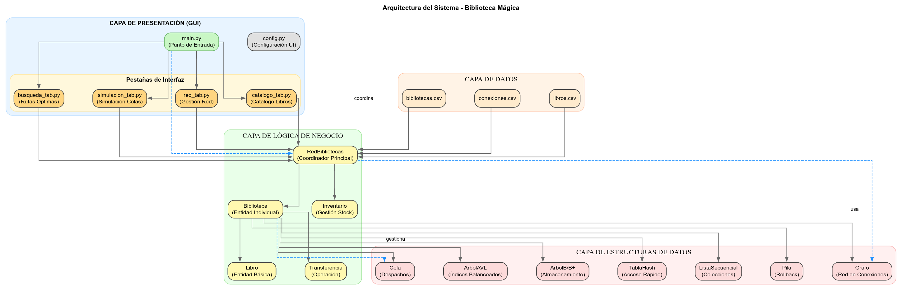
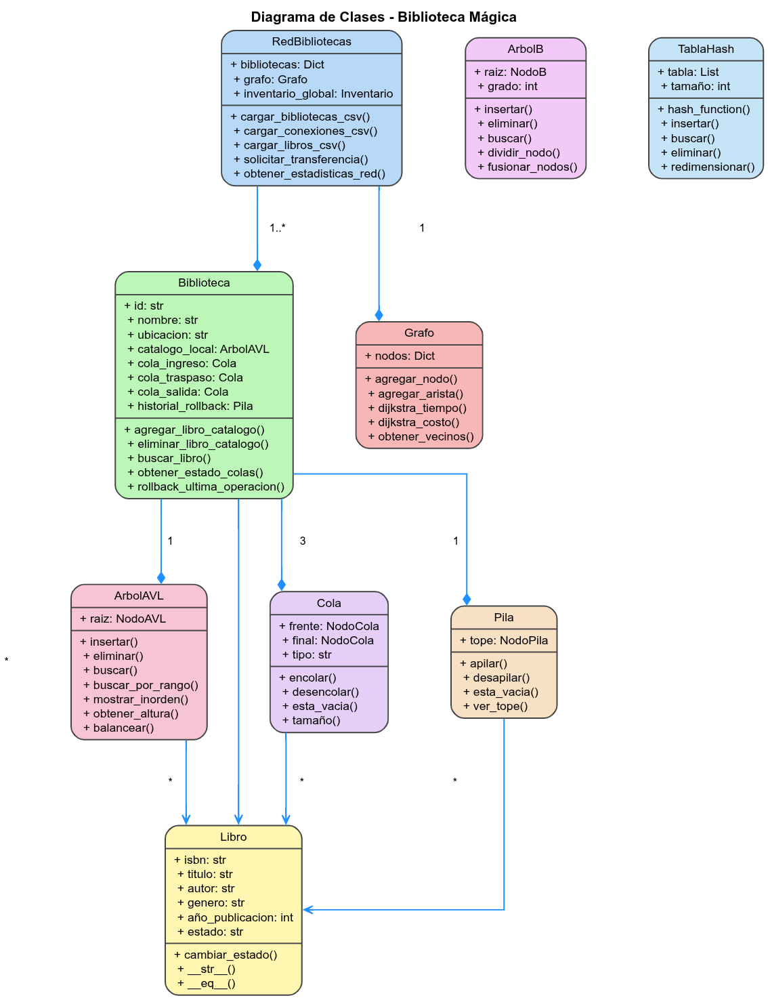

# 📈 DIAGRAMAS

## **1. 🏗️ DIAGRAMA DE ARQUITECTURA DEL SISTEMA**

## **2. 🗂️ DIAGRAMA UML DE CLASES PRINCIPALES**

## **3. 📊 DIAGRAMA DE ESTRUCTURAS DE DATOS**

## **4. 🔄 DIAGRAMA DE FLUJO DE DATOS**

## **5. 🎯 DIAGRAMA DE CASOS DE USO**

## **🎯 ESTOS DIAGRAMAS SON PARA:**

✅ **Arquitectura completa** - Capas y componentes  
✅ **UML** - Clases y relaciones  
✅ **Estructuras visuales** - Organización de datos  
✅ **Flujo de información** - Cómo circulan los datos  
✅ **Casos de uso** - Funcionalidades del sistema  
