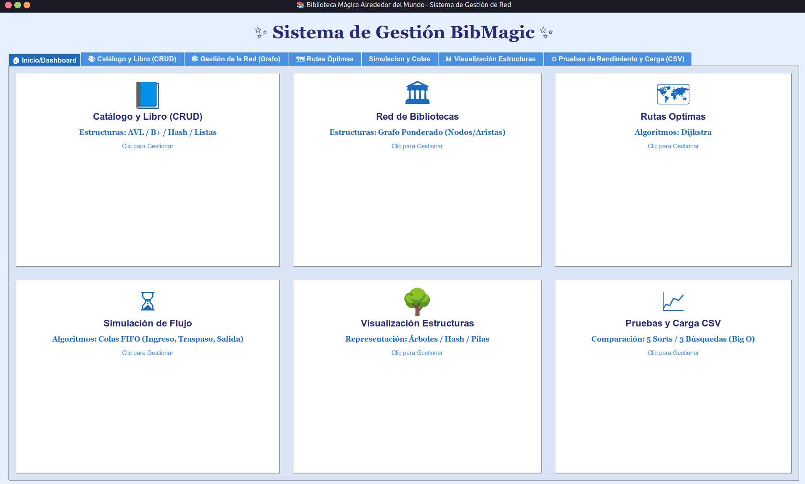
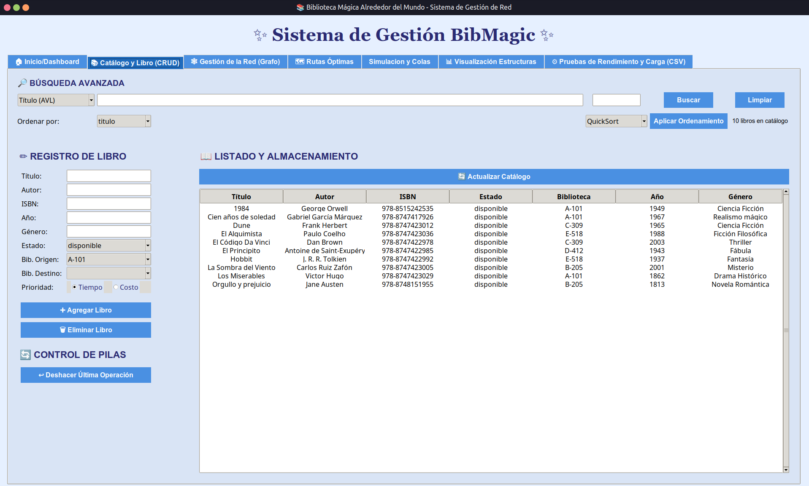
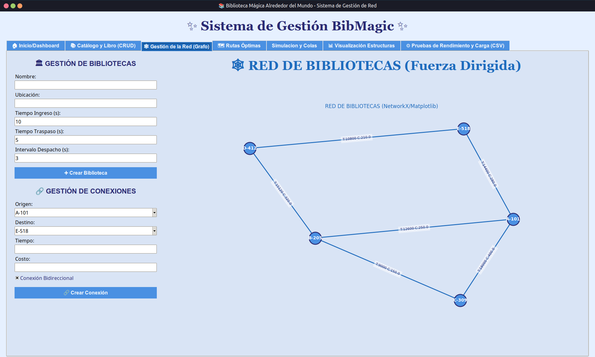
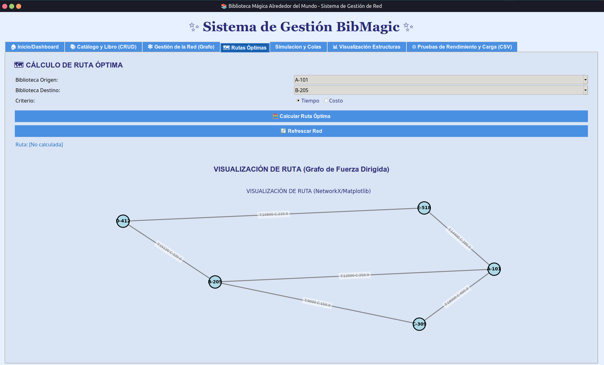
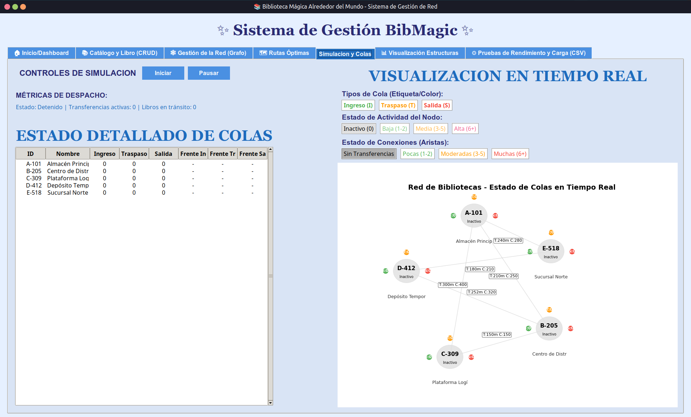
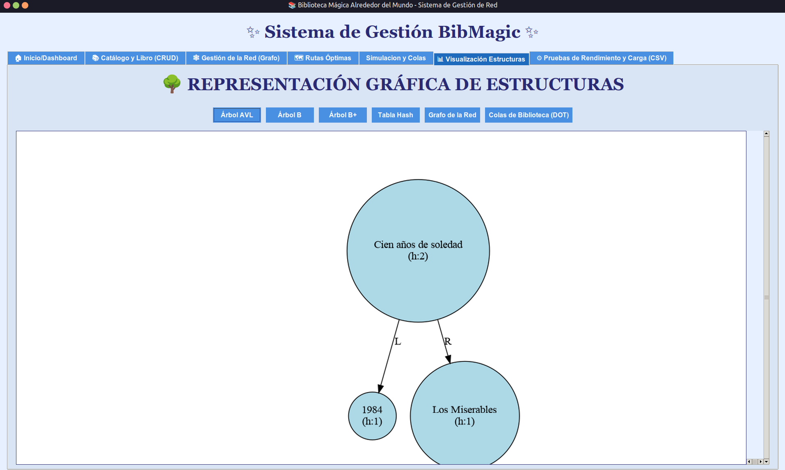
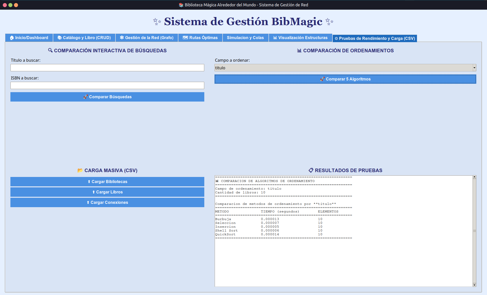

# 📚 Manual de Usuario: Sistema de Gestión BibMagic (Orden Secuencial 1-7)

## 1. 🚀 Panel Principal (Dashboard)

El Dashboard es el punto de inicio que organiza el acceso a todos los módulos del sistema.

### Módulo: Inicio/Dashboard

- El sistema se divide en **seis módulos funcionales** principales, representados por tarjetas y accesibles a través de la barra de navegación superior.

- Cada tarjeta describe las estructuras o algoritmos subyacentes (e.g., **AVL, B+, Dijkstra, Colas FIFO**) que gestiona ese módulo.

---

## 2. 📘 Administración de Catálogo y Libros (CRUD)

Este módulo se usa para la gestión diaria del inventario, inserción y búsqueda de libros.

### Módulo: Catálogo y Libro (CRUD)

1. **REGISTRO DE LIBRO:** Ingrese todos los atributos (Título, ISBN, Autor, etc.). Para transferencias, seleccione **Bib. Origen**, **Bib. Destino** y la **Prioridad** (Tiempo o Costo).

2. **LISTADO Y ALMACENAMIENTO:** La tabla principal muestra el inventario. Use la opción **Ordenar por** y **Aplicar Ordenamiento** (ej. QuickSort) para cambiar la vista.

3. **BÚSQUEDA AVANZADA:** Realice búsquedas rápidas por Título, ISBN u otros criterios.

4. **CONTROL DE PILAS:** Use **Deshacer Última Operación** para revertir una acción de registro reciente.

---

## 3. 🏛️ Configuración de la Red y Conexiones

Aquí se construye y se define la topología del grafo de bibliotecas.

### Módulo: Gestión de la Red (Grafo)

1. **GESTIÓN DE BIBLIOTECAS (Nodos):**
   
   - Ingrese los datos (Nombre, Ubicación) y configure los tiempos de simulación: **Tiempo Ingreso (s)**, **Tiempo Traspaso (s)** e **Intervalo Despacho (s)**.
   
   - Haga clic en **+ Crear Biblioteca**.

2. **GESTIÓN DE CONEXIONES (Aristas):**
   
   - Seleccione **Origen** y **Destino**. Defina los pesos de la arista: **Tiempo** y **Costo**.
   
   - Haga clic en **Crear Conexión**.
   
   - La **RED DE BIBLIOTECAS (Fuerza Dirigida)** se actualizará en tiempo real con los nodos y aristas.

---

## 4. 🗺️ Cálculo de Rutas Óptimas

Este módulo calcula el camino más eficiente para la transferencia de libros usando algoritmos de grafo.

### Módulo: Rutas Óptimas

1. Vaya a la pestaña **Rutas Óptimas**.

2. Seleccione la **Biblioteca Origen** y **Biblioteca Destino**.

3. Elija el **Criterio** para el cálculo de la ruta: **Tiempo** o **Costo**.

4. Haga clic en **Calcular Ruta Óptima**.

5. El resultado de la ruta se mostrará en el campo **Ruta:** y se resaltará en la **VISUALIZACIÓN DE RUTA** (Grafo de Fuerza Dirigida).

---

## 5. ⏳ Simulación de Flujo y Monitoreo de Colas

Módulo esencial para visualizar y controlar el movimiento de libros a través de las colas de las bibliotecas.

### Módulo: Simulación y Colas

1. **CONTROLES DE SIMULACIÓN:** Haga clic en **Iniciar** para comenzar la simulación del flujo de libros en tránsito.

2. **ESTADO DETALLADO DE COLAS:** Muestra la cantidad de libros en las colas **Ingreso**, **Traspaso** y **Salida** para cada biblioteca.

3. **VISUALIZACION EN TIEMPO REAL:** El grafo inferior muestra el **Estado de Actividad del Nodo** (ej. Inactivo, Traspaso) y el flujo de libros en las conexiones mediante etiquetas y colores.

---

## 6. 🌳 Inspección Gráfica de Estructuras

Utilice esta herramienta para validar la integridad de las estructuras de datos internas.

### Módulo: Visualización Estructuras

1. Vaya a la pestaña **Visualización Estructuras**.

2. Haga clic en la pestaña de la estructura que desea inspeccionar: **Árbol AVL**, **Árbol B**, **Tabla Hash**, etc.

3. La **REPRESENTACIÓN GRÁFICA DE ESTRUCTURAS** mostrará el diagrama (ej. un árbol con nodos y altura), permitiendo verificar el correcto balanceo y organización de las claves.

---

## 7. 📈 Pruebas de Rendimiento y Carga de Datos

Este módulo permite la importación masiva de datos y la comparación de la eficiencia algorítmica.

### Módulo: Pruebas de Rendimiento y Carga (CSV)

1. **CARGA MASIVA (CSV):** Utilice los botones **! Cargar Bibliotecas**, **! Cargar Libros** y **! Cargar Conexiones** para importar datos masivamente desde archivos CSV.

2. **COMPARACIÓN INTERACTIVA DE BÚSQUEDAS:** Ingrese valores y haga clic en **Comparar Búsquedas** para medir el tiempo de ejecución de las búsquedas Secuencial, Binaria y Hash.

3. **COMPARACIÓN DE ORDENAMIENTOS:** Seleccione un campo (ej. título) y haga clic en **Comparar 5 Algoritmos**. Los **RESULTADOS DE PRUEBAS** mostrarán el tiempo de ejecución de los distintos métodos de ordenamiento.

