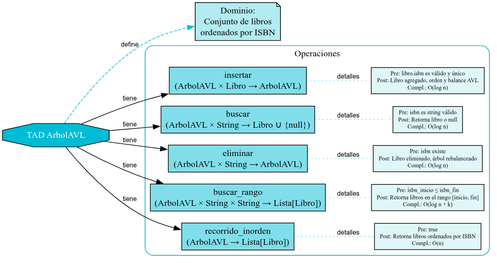
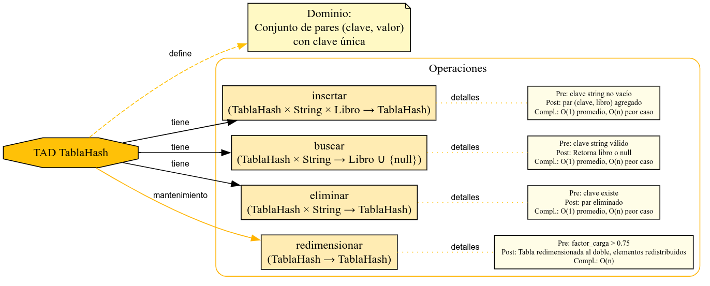
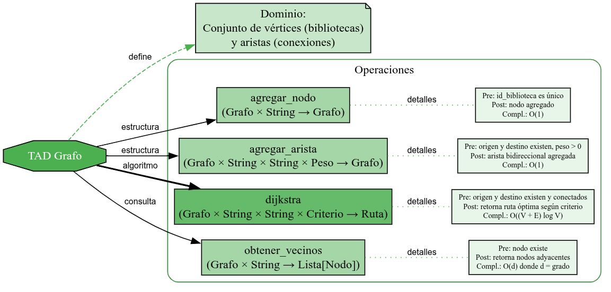
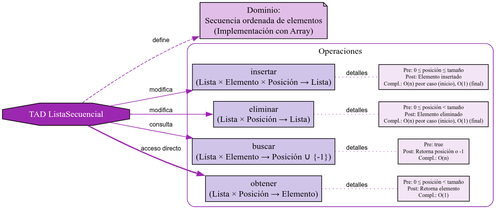
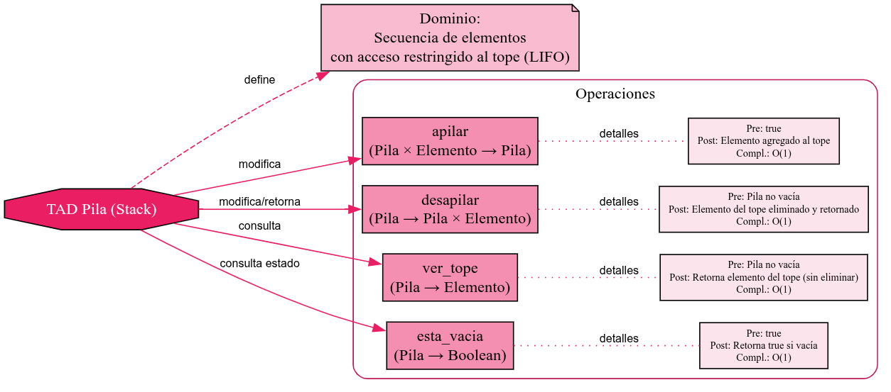
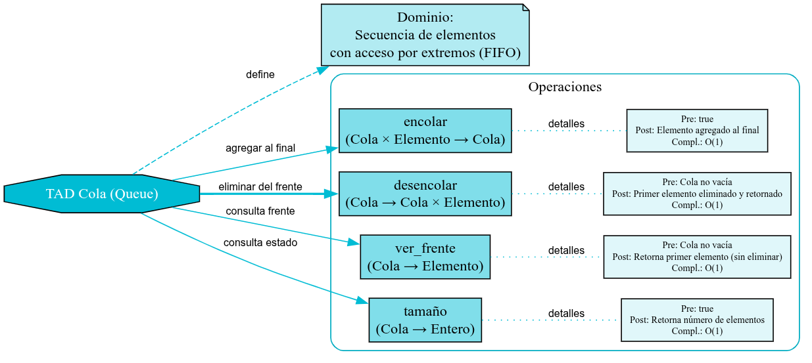
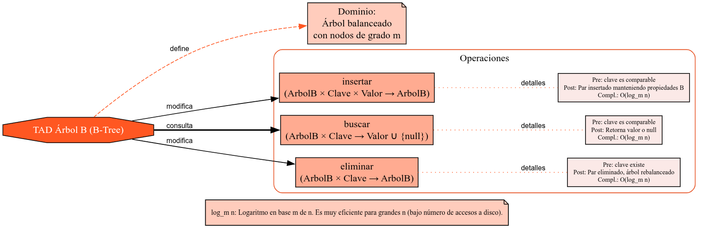
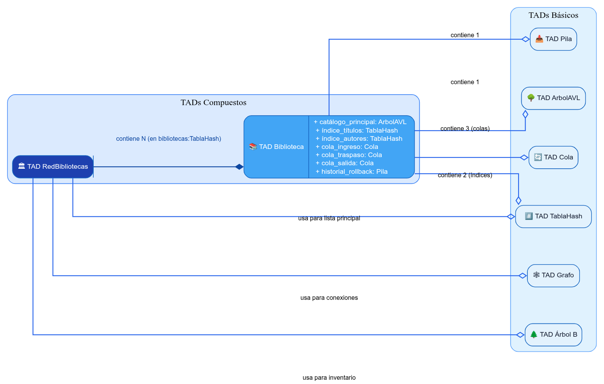

# 📚 DOCUMENTACIÓN DE TIPOS ABSTRACTOS DE DATOS (TADs)

## 🎯 INTRODUCCIÓN

Aquí se especifica los TADs implementados en el Sistema de Gestión de Bibliotecas, definiendo sus operaciones, precondiciones, postcondiciones y complejidades temporales.

---

## 1. 🌳 TAD ÁRBOL AVL

### **Definición:**

Árbol binario de búsqueda auto-balanceado que mantiene la propiedad AVL: la diferencia de alturas entre subárboles no excede 1.

### **Uso en el proyecto:**

Almacenamiento principal del catálogo de libros, indexado por ISBN para garantizar búsquedas eficientes.



### **Especificación Formal:**

```
TAD ArbolAVL
    Dominio: Conjunto de libros ordenados por ISBN

    Operaciones:

    insertar: ArbolAVL × Libro → ArbolAVL
    Pre: libro.isbn es válido y único
    Post: El libro se agrega manteniendo orden y balance AVL
    Complejidad: O(log n)

    buscar: ArbolAVL × String → Libro ∪ {null}
    Pre: isbn es string válido
    Post: retorna libro con ese ISBN o null si no existe
    Complejidad: O(log n)

    eliminar: ArbolAVL × String → ArbolAVL
    Pre: isbn existe en el árbol
    Post: libro eliminado, árbol rebalanceado
    Complejidad: O(log n)

    buscar_rango: ArbolAVL × String × String → Lista[Libro]
    Pre: isbn_inicio ≤ isbn_fin
    Post: retorna libros en el rango [inicio, fin]
    Complejidad: O(log n + k) donde k = resultados

    recorrido_inorden: ArbolAVL → Lista[Libro]
    Pre: true
    Post: retorna libros ordenados por ISBN
    Complejidad: O(n)
```

### **Implementación Específica:**

```python
class ArbolAVL:
    def __init__(self):
        self.raiz = None
        self.tamaño = 0

    def insertar(self, libro):
        """
        Inserta un libro manteniendo balance AVL
        Invariante: Factor de balance ∈ {-1, 0, 1}
        """
        self.raiz = self._insertar_recursivo(self.raiz, libro)
        self.tamaño += 1

    def buscar(self, isbn):
        """
        Búsqueda binaria en árbol balanceado
        Garantiza: máximo log₂(n) comparaciones
        """
        return self._buscar_recursivo(self.raiz, isbn)
```

### **Propiedades del TAD:**

- **Orden:** Subárbol izquierdo < raíz < subárbol derecho
- **Balance:** |altura(izq) - altura(der)| ≤ 1
- **Completitud:** Todas las operaciones preservan las propiedades AVL

---

## 2. 🔢 TAD TABLA HASH

### **Definición:**

Estructura que mapea claves a valores usando función hash, con resolución de colisiones por encadenamiento.

### **Uso en el proyecto:**

Índice secundario para búsquedas rápidas por título, autor y género de libros.



### **Especificación Formal:**

```
TAD TablaHash
    Dominio: Conjunto de pares (clave, valor) con clave única

    Operaciones:

    insertar: TablaHash × String × Libro → TablaHash
    Pre: clave es string no vacío
    Post: par (clave, libro) agregado a la tabla
    Complejidad: O(1) promedio, O(n) peor caso

    buscar: TablaHash × String → Libro ∪ {null}
    Pre: clave es string válido
    Post: retorna libro asociado o null
    Complejidad: O(1) promedio, O(n) peor caso

    eliminar: TablaHash × String → TablaHash
    Pre: clave existe en la tabla
    Post: par eliminado de la tabla
    Complejidad: O(1) promedio, O(n) peor caso

    redimensionar: TablaHash → TablaHash
    Pre: factor_carga > 0.75
    Post: tabla redimensionada al doble, elementos redistribuidos
    Complejidad: O(n)
```

### **Función Hash Implementada:**

```python
def hash_function(self, clave):
    """
    Función hash polinomial para strings
    h(s) = Σ(s[i] * 31^(n-1-i)) mod tamaño_tabla
    """
    hash_value = 0
    for i, char in enumerate(clave):
        hash_value = (hash_value * 31 + ord(char)) % self.tamaño
    return hash_value
```

### **Manejo de Colisiones:**

- **Método:** Encadenamiento con listas enlazadas
- **Factor de carga objetivo:** ≤ 0.75
- **Redimensionamiento:** Automático cuando se excede el factor

---

## 3. 🕸️ TAD GRAFO

### **Definición:**

Grafo dirigido ponderado que representa la red de bibliotecas con conexiones bidireccionales.

### **Uso en el proyecto:**

Modelar conexiones entre bibliotecas con pesos de tiempo y costo para cálculo de rutas óptimas.



### **Especificación Formal:**

```
TAD Grafo
    Dominio: Conjunto de vértices (bibliotecas) y aristas (conexiones)

    Operaciones:

    agregar_nodo: Grafo × String → Grafo
    Pre: id_biblioteca es identificador único
    Post: nodo agregado al grafo
    Complejidad: O(1)

    agregar_arista: Grafo × String × String × Peso → Grafo
    Pre: origen y destino existen, peso > 0
    Post: arista bidireccional agregada
    Complejidad: O(1)

    dijkstra: Grafo × String × String × Criterio → Ruta
    Pre: origen y destino existen y están conectados
    Post: retorna ruta óptima según criterio (tiempo/costo)
    Complejidad: O((V + E) log V)

    obtener_vecinos: Grafo × String → Lista[Nodo]
    Pre: nodo existe en el grafo
    Post: retorna nodos adyacentes
    Complejidad: O(d) donde d = grado del nodo
```

### **Representación:**

```python
class Grafo:
    def __init__(self):
        self.nodos = {}  # Dict[String, List[Arista]]
        self.num_vertices = 0

    def agregar_arista(self, origen, destino, tiempo, costo):
        """
        Agrega arista bidireccional con dos pesos
        Invariante: Si existe (u,v) entonces existe (v,u)
        """
        arista_directa = Arista(destino, tiempo, costo)
        arista_inversa = Arista(origen, tiempo, costo)

        self.nodos[origen].append(arista_directa)
        self.nodos[destino].append(arista_inversa)
```

---

## 4. 📋 TAD LISTA SECUENCIAL

### **Definición:**

Estructura lineal que almacena elementos en posiciones contiguas con acceso indexado.

### **Uso en el proyecto:**

Almacenamiento de resultados de búsquedas, historial de operaciones, y colecciones temporales.



### **Especificación Formal:**

```
TAD ListaSecuencial
    Dominio: Secuencia ordenada de elementos

    Operaciones:

    insertar: ListaSecuencial × Elemento × Posición → ListaSecuencial
    Pre: 0 ≤ posición ≤ tamaño
    Post: elemento insertado en la posición especificada
    Complejidad: O(n) peor caso, O(1) al final

    eliminar: ListaSecuencial × Posición → ListaSecuencial
    Pre: 0 ≤ posición < tamaño
    Post: elemento en posición eliminado
    Complejidad: O(n) peor caso, O(1) al final

    buscar: ListaSecuencial × Elemento → Posición ∪ {-1}
    Pre: true
    Post: retorna posición del elemento o -1
    Complejidad: O(n)

    obtener: ListaSecuencial × Posición → Elemento
    Pre: 0 ≤ posición < tamaño
    Post: retorna elemento en la posición
    Complejidad: O(1)
```

### **Invariantes:**

- **Capacidad:** Se redimensiona automáticamente cuando se llena
- **Orden:** Mantiene el orden de inserción
- **Acceso:** Acceso directo por índice en tiempo constante

---

## 5. 📚 TAD PILA (LIFO)

### **Definición:**

Estructura lineal que sigue el principio "Último en Entrar, Primero en Salir".

### **Uso en el proyecto:**

Sistema de rollback para deshacer operaciones recientes en cada biblioteca.



### **Especificación Formal:**

```
TAD Pila
    Dominio: Secuencia de elementos con acceso restringido al tope

    Operaciones:

    apilar: Pila × Elemento → Pila
    Pre: true
    Post: elemento agregado al tope de la pila
    Complejidad: O(1)

    desapilar: Pila → Pila × Elemento
    Pre: pila no vacía
    Post: elemento del tope eliminado y retornado
    Complejidad: O(1)

    ver_tope: Pila → Elemento
    Pre: pila no vacía
    Post: retorna elemento del tope sin eliminarlo
    Complejidad: O(1)

    esta_vacia: Pila → Boolean
    Pre: true
    Post: retorna true si la pila está vacía
    Complejidad: O(1)
```

### **Implementación Específica:**

```python
class PilaRollback:
    def __init__(self, capacidad_maxima=50):
        self.elementos = []
        self.capacidad = capacidad_maxima

    def apilar(self, operacion):
        """
        Registra operación para posible rollback
        Invariante: tamaño ≤ capacidad_maxima
        """
        if len(self.elementos) >= self.capacidad:
            self.elementos.pop(0)  # Eliminar más antigua
        self.elementos.append(operacion)
```

---

## 6. 🚶 TAD COLA (FIFO)

### **Definición:**

Estructura lineal que sigue el principio "Primero en Entrar, Primero en Salir".

### **Uso en el proyecto:**

Sistema de despacho con 3 colas por biblioteca: ingreso, traspaso y salida.



### **Especificación Formal:**

```
TAD Cola
    Dominio: Secuencia de elementos con acceso por extremos

    Operaciones:

    encolar: Cola × Elemento → Cola
    Pre: true
    Post: elemento agregado al final de la cola
    Complejidad: O(1)

    desencolar: Cola → Cola × Elemento
    Pre: cola no vacía
    Post: primer elemento eliminado y retornado
    Complejidad: O(1)

    ver_frente: Cola → Elemento
    Pre: cola no vacía
    Post: retorna primer elemento sin eliminarlo
    Complejidad: O(1)

    tamaño: Cola → Entero
    Pre: true
    Post: retorna número de elementos en la cola
    Complejidad: O(1)
```

### **Tipos de Colas en el Sistema:**

1. **Cola de Ingreso:** Libros que llegan de otras bibliotecas
2. **Cola de Traspaso:** Libros en proceso de transferencia  
3. **Cola de Salida:** Libros listos para despacho

```python
class ColaDespacho:
    def __init__(self, tipo):
        self.frente = None
        self.final = None
        self.tipo = tipo  # "ingreso", "traspaso", "salida"
        self.contador = 0

    def encolar(self, libro):
        """
        Agrega libro al final de la cola de despacho
        Invariante: frente apunta al primer elemento
        """
        nuevo_nodo = NodoCola(libro)
        if self.final is None:
            self.frente = self.final = nuevo_nodo
        else:
            self.final.siguiente = nuevo_nodo
            self.final = nuevo_nodo
        self.contador += 1
```

---

## 7. 🌲 TAD ÁRBOL B/B+

### **Definición:**

Árbol multicamino balanceado optimizado para acceso a disco, con nodos de grado variable.

### **Uso en el proyecto:**

Almacenamiento de índices secundarios para búsquedas complejas y reportes.



### **Especificación Formal:**

```
TAD ArbolB
    Dominio: Árbol balanceado con nodos de grado m

    Operaciones:

    insertar: ArbolB × Clave × Valor → ArbolB
    Pre: clave es comparable
    Post: par insertado manteniendo propiedades B
    Complejidad: O(log_m n)

    buscar: ArbolB × Clave → Valor ∪ {null}
    Pre: clave es comparable
    Post: retorna valor asociado o null
    Complejidad: O(log_m n)

    eliminar: ArbolB × Clave → ArbolB
    Pre: clave existe en el árbol
    Post: par eliminado, árbol rebalanceado
    Complejidad: O(log_m n)
```

### **Propiedades B-Tree:**

- **Grado mínimo:** t ≥ 2
- **Claves por nodo:** Entre t-1 y 2t-1
- **Altura:** O(log_t n)
- **Balance:** Todas las hojas al mismo nivel

---

## 🔗 RELACIONES ENTRE TADs



### **Composición en el Sistema:**

```
Biblioteca {
    catálogo_principal: ArbolAVL<ISBN, Libro>
    índice_títulos: TablaHash<Título, Libro>
    índice_autores: TablaHash<Autor, Lista<Libro>>
    cola_ingreso: Cola<Libro>
    cola_traspaso: Cola<Libro>
    cola_salida: Cola<Libro>
    historial_rollback: Pila<Operación>
}

RedBibliotecas {
    bibliotecas: TablaHash<ID, Biblioteca>
    grafo_conexiones: Grafo<Biblioteca, Conexión>
    inventario_global: ArbolB<Categoría, Estadísticas>
}
```

### **Flujo de Datos Entre TADs:**

1. **Búsqueda:** TablaHash → ArbolAVL → ListaSecuencial (resultados)
2. **Transferencia:** ArbolAVL → Cola → Grafo (ruta) → Cola
3. **Rollback:** Pila → ArbolAVL (deshacer inserción/eliminación)
4. **Simulación:** Cola → Cola → ArbolAVL (procesamiento)

---

## 📊 TABLA RESUMEN DE COMPLEJIDADES

| TAD                 | Inserción | Búsqueda        | Eliminación | Uso Principal         |
| ------------------- | --------- | --------------- | ----------- | --------------------- |
| **ArbolAVL**        | O(log n)  | O(log n)        | O(log n)    | Catálogo principal    |
| **TablaHash**       | O(1)*     | O(1)*           | O(1)*       | Índices secundarios   |
| **Grafo**           | O(1)      | O((V+E)log V)** | O(1)        | Cálculo de rutas      |
| **ListaSecuencial** | O(n)      | O(n)            | O(n)        | Resultados temporales |
| **Pila**            | O(1)      | -               | O(1)        | Sistema rollback      |
| **Cola**            | O(1)      | -               | O(1)        | Sistema despacho      |
| **ArbolB**          | O(log n)  | O(log n)        | O(log n)    | Índices complejos     |

*Promedio, O(n) peor caso*  
**Para algoritmo Dijkstra**

---

## 🎯 JUSTIFICACIÓN DE SELECCIÓN

### **Criterios de Selección:**

1. **Frecuencia de operación:** Búsquedas frecuentes → AVL, Hash
2. **Tipo de acceso:** Secuencial → Cola, Aleatorio → Hash  
3. **Restricciones de memoria:** Eficiencia → AVL vs ArbolB
4. **Consistencia de rendimiento:** AVL vs Hash para garantías

### **Trade-offs Considerados:**

- **AVL vs Hash:** Garantía O(log n) vs Promedio O(1)
- **Lista vs Cola:** Flexibilidad vs Especialización
- **ArbolB vs AVL:** Memoria vs Simplicidad

**Cada TAD fue seleccionado específicamente para optimizar las operaciones más frecuentes en el dominio de gestión de bibliotecas.**
